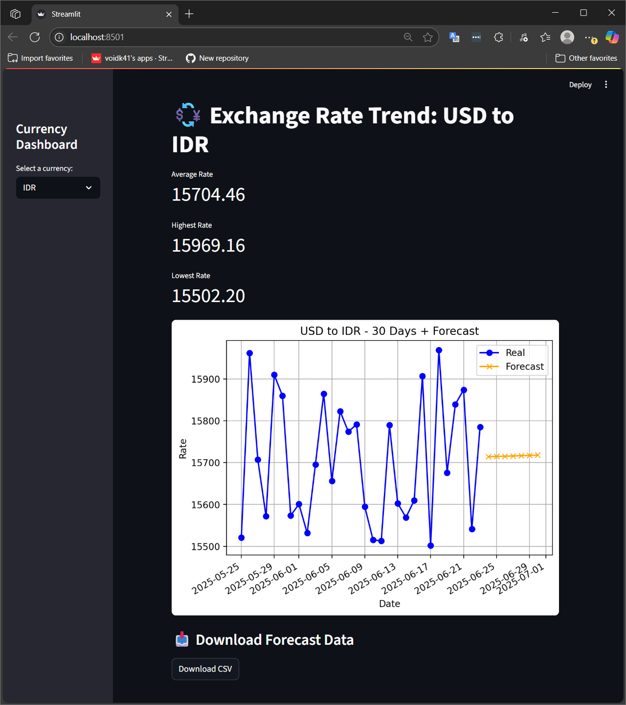

# 📊 Currency Forecast Dashboard


A lightweight and interactive Streamlit dashboard for tracking USD exchange rates and forecasting currency trends.

---

## 📸 Preview



---

## 🚀 Features

- ✅ **Multi-Currency Support**  
  Track USD exchange rate to **IDR**, **EUR**, **GBP**, or **JPY**

- 📈 **30-Day Historical Trend**  
  Visualize exchange rates from the last 30 days using a clean line chart

- 🔮 **7-Day Forecast**  
  Predict the next 7 days based on recent trends using linear regression (via scikit-learn)

- 🧮 **Key Metrics Display**  
  Instantly view the **average**, **minimum**, and **maximum** values

- 📥 **Downloadable CSV**  
  Export full data (real + forecast) for reporting or analysis

---

## 🧠 Tech Stack

| Tool           | Purpose                         |
|----------------|----------------------------------|
| `Streamlit`    | UI/dashboard framework           |
| `Pandas`       | Data manipulation                |
| `Requests`     | Simulated API integration        |
| `scikit-learn` | Forecasting (linear regression)  |
| `Matplotlib`   | Visualization engine             |

---

## 📁 Folder Structure

```
currency_dashboard/
├── data/
│   ├── dummy_currency_rates.csv
├── src/
│   ├── fetch_data.py
│   └── forecast.py
├── assets/
│   └── screenshot.png
├── app.py
├── .gitignore
├── requirements.txt
├── LICENSE
└── README.md
```

---

## 🚀 How to Run

1. Clone this repository
2. Create and activate a virtual environment:
   ```bash
   python -m venv venv
   venv\Scripts\activate  # Windows
   ```
3. Install dependencies:
   ```bash
   pip install -r requirements.txt
   ```
4. Fetch or simulate data:
   ```bash
   python src/fetch_data.py
   ```
5. Run the dashboard:
   ```bash
   streamlit run app.py
   ```
---

## 📦 How It Works

1. `fetch_data.py` simulates historical currency data and stores it in `currency_rates.csv`
2. `forecast.py` uses linear regression to predict the next 7 days of rates
3. `app.py` renders everything into an interactive dashboard with:
   - Currency selector
   - Real + forecast chart
   - Key statistics (avg/min/max)
   - Download button (CSV)

---

## 🧪 Example Use Cases

- Freelancers visualizing FX trends  
- MVP prototype for financial tools  
- Budget travelers or e-commerce sellers  
- Educational data analytics demo  

---

## 📄 Disclaimer

> This project simulates exchange rate data for educational and demonstration purposes using the format of [exchangerate.host](https://exchangerate.host) — not live financial data.

---

## 👨‍💻 Author

**Khairu Ikramendra**  
Available for freelance dashboard & data analytics projects.  
Let’s connect on [LinkedIn](https://www.linkedin.com/in/khairuikramendra/)  
Or explore more on [Upwork](https://www.upwork.com/freelancers/~017002e8546494c6e9?mp_source=share)

---

MIT License — feel free to use and modify for your own projects.  
See [LICENSE](LICENSE) for full terms.
